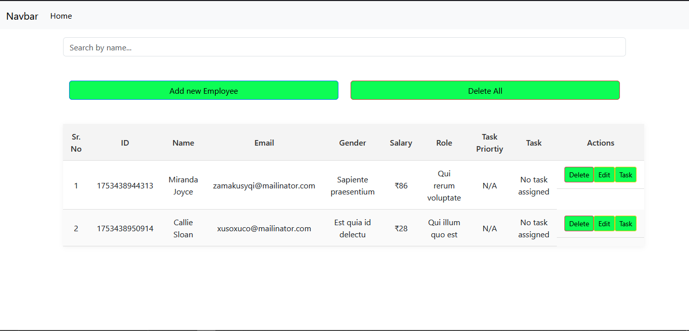

# Employee Manager App 🧑‍💼

A simple CRUD (Create, Read, Update, Delete) application built using **Node.js**, **Express**, and **EJS** to manage employee records. This app uses in-memory storage (no database) and is ideal for learning backend fundamentals like routing, forms, and dynamic rendering.

🚀 **Live Demo:** [node-crud-emp.onrender.com](https://node-crud-emp.onrender.com/)

---

## ✨ Features

- Add a new employee (with name, email, gender, salary, role)
- Edit employee details on the same page
- Delete employee records
- View all employees in a neat table
- Assign task descriptions and priorities (basic placeholder values for now)
- Toggle between the form and the employee table

---

## 🛠 Tech Stack

- **Backend**: Node.js, Express
- **Templating Engine**: EJS
- **Frontend**: HTML, Bootstrap 5, custom CSS
- **Hosting**: Render

---

